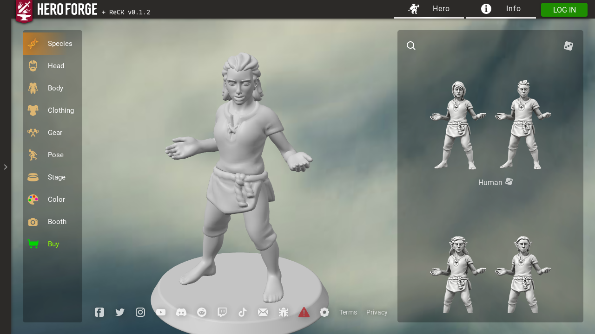
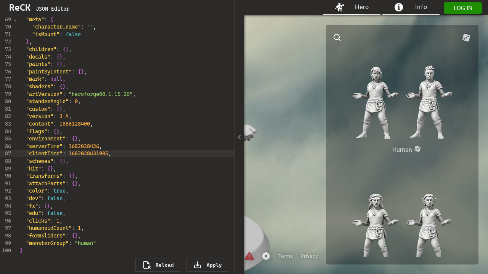

# ReCK for Hero Forge

A userscript that allows you to edit the JSON data of [Hero Forge][] characters.

## Installation

 1. Install a userscript manager such as [Violentmonkey][] or [Tampermonkey][].
 2. Click the button below to open your userscript manager’s installation page,
    then click *Install* (or equivalent) to confirm the installation.

**[<kbd>&nbsp; &nbsp;Install ReCK&nbsp; &nbsp;</kbd>][Install ReCK]**

## Usage

After installing the script, a sidebar (collapsed by default) will appear beside
Hero Forge. Once expanded, the sidebar includes a text editor (powered by
[CodeMirror 6][]) and two buttons:

  - The **Reload** button will load the current character data from Hero Forge
    into the text editor.
  - The **Apply** button will apply the character data in the text editor to
    Hero Forge, completely replacing the current character and all of Hero
    Forge’s undo history (the text editor’s undo history will remain unchanged).

Pressing <kbd>Tab</kbd> or <kbd>Shift</kbd> + <kbd>Tab</kbd> inside the text
editor will indent or unindent the text. To change focus instead, press
<kbd>Escape</kbd> before pressing <kbd>Tab</kbd>.

## Screenshots

[Hero Forge]: https://heroforge.com/
[Violentmonkey]: https://violentmonkey.github.io/
[Tampermonkey]: https://www.tampermonkey.net/
[Install ReCK]: https://github.com/arm32x/hero-forge-reck/releases/latest/download/hero-forge-reck.user.js
[CodeMirror 6]: https://codemirror.net/
